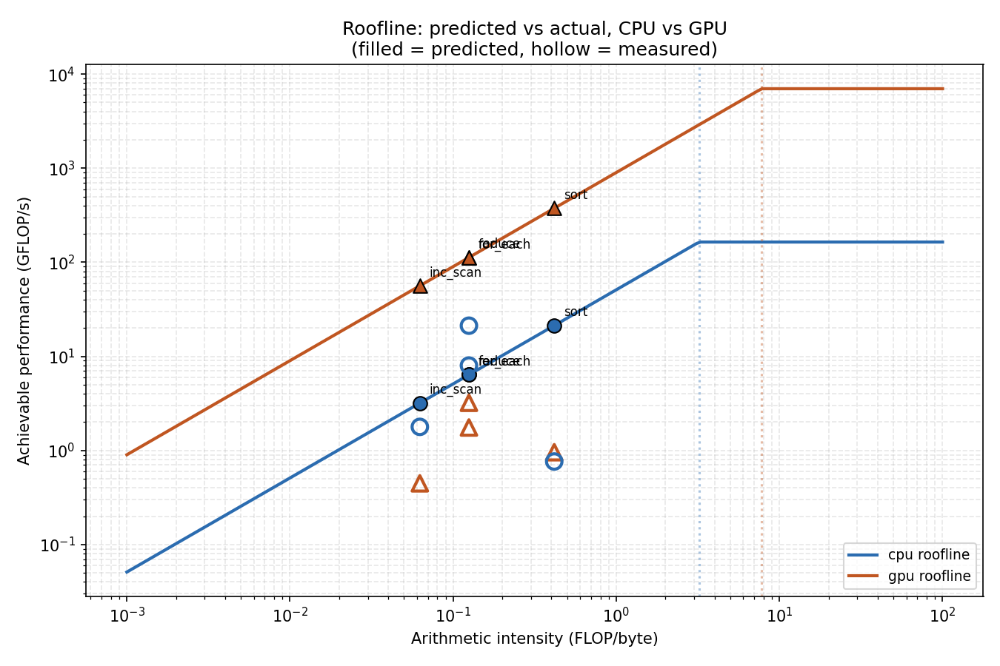

# Roofline-Based Offload Advisor

Predicts whether GPU offload is worthwhile for a parallel-STL-style kernel
**before running it**, using the roofline performance model, and validates
those predictions against real pSTL-Bench measurements on a Tesla
V100-PCIe-32GB and a 64-core CPU node (exa03, University of Vienna
scientific computing cluster).

This is a follow-on to an earlier project extending pSTL-Bench with a SYCL
backend (see "Background" below). That work found that GPU offload
profitability seemed to hinge on a kernel's arithmetic intensity. This
project turns that observation into a predictive tool and stress-tests it
against real data — which surfaces a more interesting result than a clean
validation would have: **the naive roofline model is not sufficient on its
own**, and the reason why is itself the finding.

## Background

Original work (pSTL-Bench SYCL backend extension) benchmarked five
parallel STL algorithms — `for_each`, `reduce`, `find`, `sort`,
`inclusive_scan` — across CPU and GPU using AdaptiveCpp/SYCL, against GNU
and TBB baselines. Headline findings:
- GPU performance was dominated by PCIe transfer (~98% of runtime for
  memory-bound kernels).
- SYCL on CPU was ~7x slower than TBB/GNU baselines despite running on
  the same hardware, due to the SYCL kernel structure limiting compiler
  auto-vectorization.
- Only `sort` outperformed the CPU baseline at large input sizes on GPU,
  attributed to its higher arithmetic intensity.

This project asks: can that last observation — arithmetic intensity
determines offload profitability — be turned into a quantitative,
*predictive* model, and how well does it actually hold up?

## Method

**1. Hardware characterization** (`benchmarks/compute_bound.cpp`,
`benchmarks/bandwidth_bound.cpp`): micro-benchmarks measure each device's
achievable peak GFLOP/s (FMA loop, L1-resident buffer) and peak GB/s
(STREAM-triad-style kernel, swept across sizes to find the DRAM plateau
via `scripts/sweep_bandwidth.sh`). These define each device's roofline —
the ceiling any real kernel's performance is measured against.

**2. Kernel characterization** (`docs/kernel_profiles.md`,
`data/kernels.csv`): each of the five algorithms is assigned a
FLOPs-per-element and bytes-per-element cost, giving an arithmetic
intensity (FLOP/byte). `find`'s data-dependent early termination makes
this ambiguous — documented explicitly rather than silently picked.

**3. Prediction** (`include/roofline/model.hpp`, `src/predict.cpp`): given
device rooflines and kernel arithmetic intensities, predicts achievable
GFLOP/s per device and searches for the input size at which GPU offload
(CPU→GPU transfer + GPU compute) becomes faster than CPU-only execution.
Two transfer-cost assumptions are modeled side by side:
  - **Naive**: a fresh full transfer on every call.
  - **Amortized**: transfer cost paid once and reused across
    `reuse_count` calls on a cached device buffer (matching how
    pSTL-Bench's USM allocations and Google Benchmark's repetition count
    actually work).

**4. Validation** (`scripts/extract_pstlbench.py`,
`scripts/build_actual_results.py`): raw pSTL-Bench Google Benchmark JSON
output is flattened, filtered to the GNU-TBB (CPU baseline) and
Clang-SYCL (GPU) backends at the largest tested input size, and converted
into achieved GFLOP/s for direct comparison against the model's
predictions.

## Results

**Hardware roofline (exa03):**

| Device | Peak GFLOP/s | Peak Bandwidth | PCIe |
|---|---|---|---|
| CPU (64-core) | 164.15 | 51.0 GB/s | — |
| GPU (V100-PCIe-32GB) | 7000.0 (FP64, spec) | 900.0 GB/s (spec) | 16.0 GB/s |

Ridge points: CPU 3.22 FLOP/byte, GPU 7.78 FLOP/byte — the GPU needs a
*more* compute-intensive kernel before compute (rather than bandwidth)
becomes the bottleneck.

**Kernel arithmetic intensity** (derived, see `docs/kernel_profiles.md`
for accounting convention):

| Kernel | AI (FLOP/byte) |
|---|---|
| find | 0.000 (early-termination case not yet modeled — open item) |
| inc_scan | 0.0625 |
| for_each | 0.125 |
| reduce | 0.125 |
| sort | 0.417 (highest of the five) |

**Predicted crossover (reuse_count=10, matching pSTL-Bench's repetition
count):**

| Kernel | Naive model | Amortized model | Actual (measured) |
|---|---|---|---|
| for_each | never crosses | always crosses (n~1000) | GPU loses (14.0 vs 63.9 GB/s) |
| reduce | never crosses | always crosses (n~1000) | GPU loses (25.7 vs 169.6 GB/s) |
| find | never crosses | never crosses | GPU loses (13.5 vs 235.6 GB/s) |
| sort | never crosses | always crosses (n~1000) | **GPU wins** (2.30 vs 1.83 GB/s at n=268M) |
| inc_scan | never crosses | always crosses (n~1000) | GPU loses (7.2 vs 28.5 GB/s) |

## core finding

Neither model variant matches reality on its own:
- The **naive** model is too pessimistic — it predicts GPU offload never
  pays off for any of the five kernels, because it doesn't account for
  device-buffer caching.
- The **amortized** model is too optimistic — once transfer is
  amortized over 10 reuses, it predicts GPU wins for every kernel except
  `find`, immediately at the smallest tested size.
- **Reality** sits between these: only `sort` — the kernel with by far
  the highest arithmetic intensity — actually crosses over.

The reason: both model variants assume each device achieves its
theoretical roofline ceiling. Neither accounts for **implementation
efficiency loss** — specifically the ~7x SYCL-vs-TBB slowdown on CPU from
lost auto-vectorization, and analogous overhead on GPU from kernel launch
and abstraction cost, both already documented empirically in the earlier
pSTL-Bench SYCL work. A kernel needs enough arithmetic intensity to
survive *that* penalty on top of the raw roofline gap — `sort` is the only
one of the five with enough headroom to do so.

**Conclusion: arithmetic intensity is necessary but not sufficient to
predict GPU offload profitability.** A complete offload-profitability
model needs an empirically-derived efficiency/overhead correction term
alongside the pure hardware roofline — pure peak-performance reasoning
systematically over- or under-predicts depending on which transfer
assumption is used.
